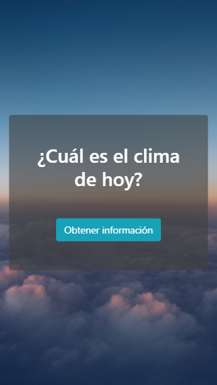
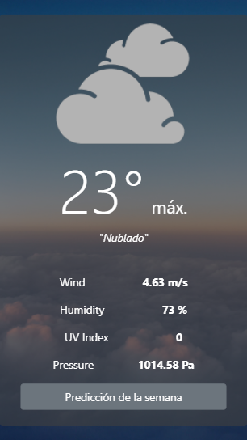
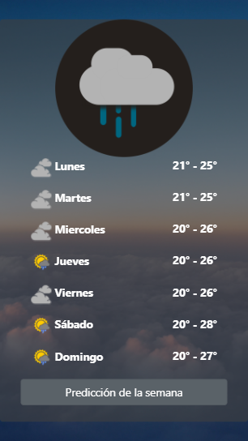

# WEATHER

* **Track:** _FRONT-END-DEVELOPER_
* **Curso:** _Construye una Single Page App (spa) multi-usuario consumiendo data remota_
* **Unidad:** _4_

***

## Introducción 

WEATHER es una aplicación que ofrece datos del clima del día y predicciones de los próximos 7 días, para esto, solicita al usuario su ubicación.

## Plan de trabajo

El proyecto se desarrolló en un día y se crearon los siguientes issues y milestones que sirven como hoja de ruta (roadmap):

* Elaborar sketch del proyecto.
* Inicializar proyecto con `npm init` y `git init`.
* Configurar servidor con node.js
* Maquetado.
* Primera parte de la funcionalidad (Geolocalización - Obtener latitud y longitud del usuario).
* Segunda parte de la funcionalidad (Obtener información del clima del día actual desde el API). 
* Tercera parte de la funcionalidad (Obtener información del clima para los próximos 7 días desde el API). 
* Elaborar readme.

## Archivos importantes

El proyecto presenta los siguientes archivos para uso del usuario:

* `README.md` con descripción de la aplicación, uso y ejemplo.
* `index.js`: Archivo js que contiene la funcionalidad de la aplicación.
* `index.html`: Página web de la aplicación.

## Especificaciones

* Se utilizó la API Dark Sky.
* Se utilizó la API de Google Maps.
* Se utilizó la librería jQuery en su versión 3.2.1 (como parte del framework bootstrap).
* Se utilizó el framework bootstrap en su versión 4.0.
* Se utilizó el estándar más recientemente aceptado de JavaScript ES2015 || ES6.
* Se utilizó el transpilador/compilador Babel para que convierta nuestro código en ES5 de forma automática.
* Se utilizó el servidor de node.js.
* Mobile first.

***

## Uso
* Se solicita la localización del usuario mediante el botón “Obtener información”. 
* Al dar click al botón, la página se redirecciona a una siguiente vista donde se observan datos del clima del día (Temperatura, velocidad del viento, humedad, índice de radiación UV y presión atmosférica).
* En esta misma vista, se tiene la opción de solicitar la predicción de los siguientes 7 días. Para ello, el usuario dará click en el botón “Predicción de la semana”.

## Ejemplo
* Vista principal del proyecto:

* Vista del datos del clima del día:

* Vista de predicción de la sgte semana:

***

## Autoras

* Rocci Escobar Nuñez [Cuenta GitHub](https://github.com/Rocciescobar "Repositorio")
* Manuela Flores Vilchez [Cuenta GitHub ](https://github.com/ManuelaFlores "Repositorio")